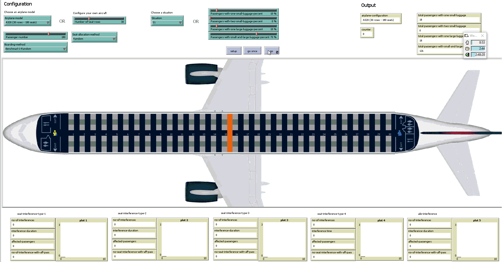
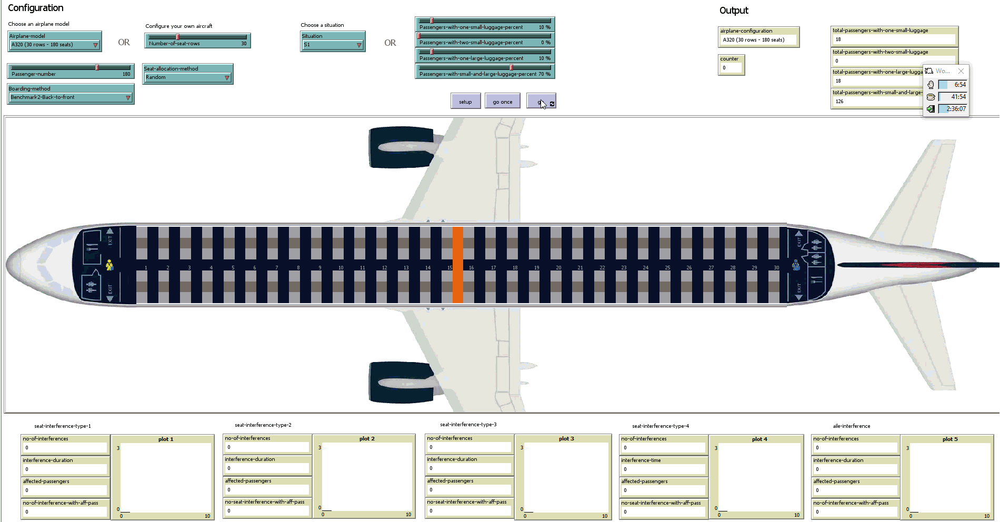
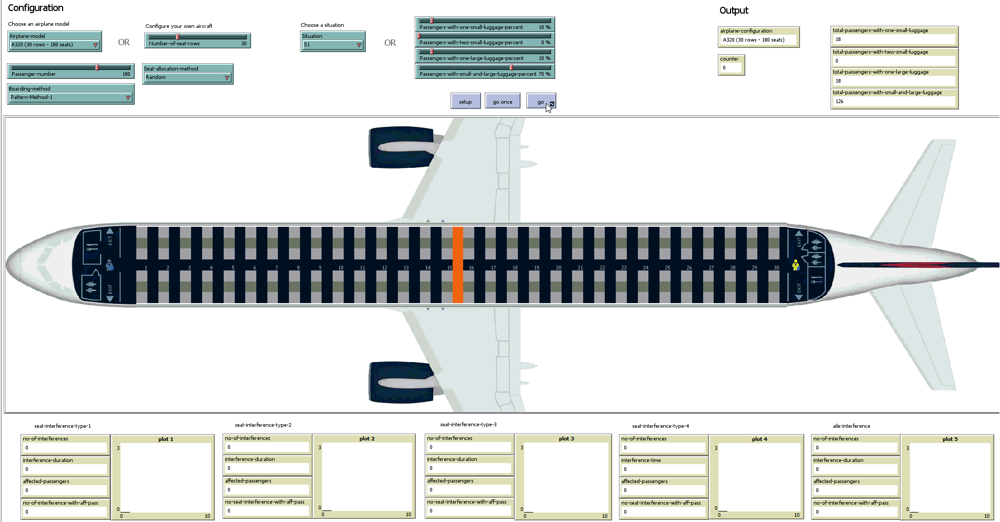
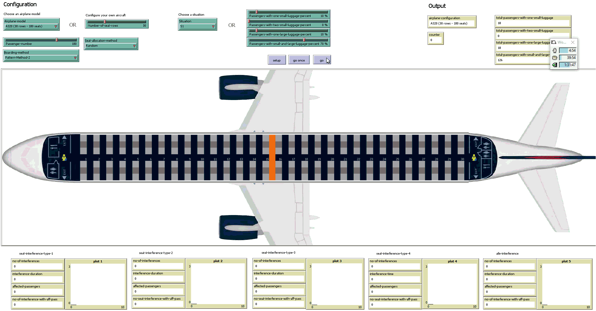

Please feel free to contact us at camelia.delcea at csie.ase .ro for the `NetLogo` source code.

# Scenarios

All the simulations have been performed using the following settings:
- luggage situation: **S1** (described in our paper);
- occupancy level: **100%** (180 passengers).

> Suggestion: You can download the animations below in order to watch them at a higher resolution.

## Benchmark1-Random

## Benchmark2-Back-to-front

## Mixed-Method-1

## Mixed-Method-2

## Pattern-Method-1

## Pattern-Method-2
